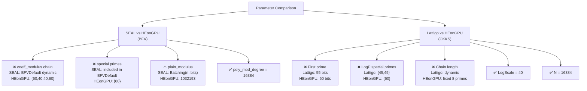

# Cryptographic Parameters Comparison

## 1. SEAL vs HEonGPU — BFV Scheme

### How parameters are set

| Parameter | SEAL (backend=0) | HEonGPU BFV (backend=2, scheme=0) | Match? |
|---|---|---|---|
| **poly_modulus_degree** | `16384` (hardcoded in [gen_func.cpp:L57](file:///c:/Users/imed/Desktop/bacckup/CHEHAB/src/fheco/code_gen/gen_func.cpp#L57)) | `16384` (hardcoded in [gen_func_heongpu.cpp:L86](file:///c:/Users/imed/Desktop/bacckup/CHEHAB/src/fheco/code_gen/gen_func_heongpu.cpp#L86)) | ✅ Yes |
| **plain_modulus** | `PlainModulus::Batching(n, <bit_size>)` — SEAL selects a prime of the requested bit size that satisfies `p ≡ 1 mod 2n` ([gen_func.cpp:L378](file:///c:/Users/imed/Desktop/bacckup/CHEHAB/src/fheco/code_gen/gen_func.cpp#L378)) | `1032193` (hardcoded literal in [gen_func_heongpu.cpp:L90](file:///c:/Users/imed/Desktop/bacckup/CHEHAB/src/fheco/code_gen/gen_func_heongpu.cpp#L90)) | ⚠️ **MAYBE** |
| **coeff_modulus (q_bits)** | `CoeffModulus::BFVDefault(16384)` when auto params disabled ([gen_func.cpp:L384](file:///c:/Users/imed/Desktop/bacckup/CHEHAB/src/fheco/code_gen/gen_func.cpp#L384)), or `CoeffModulus::Create(n, {...})` from param selector | `{60, 40, 40, 60}` (hardcoded in [gen_func_heongpu.cpp:L88](file:///c:/Users/imed/Desktop/bacckup/CHEHAB/src/fheco/code_gen/gen_func_heongpu.cpp#L88)) | ❌ **MISMATCH** |
| **coeff_modulus (p_bits)** | Implicit in `CoeffModulus::BFVDefault` (includes special prime) | `{60}` (hardcoded in [gen_func_heongpu.cpp:L89](file:///c:/Users/imed/Desktop/bacckup/CHEHAB/src/fheco/code_gen/gen_func_heongpu.cpp#L89)) | ❌ **MISMATCH** |
| **Security level** | `sec_level_type::tc128` (128-bit, [gen_func.cpp:L400](file:///c:/Users/imed/Desktop/bacckup/CHEHAB/src/fheco/code_gen/gen_func.cpp#L400)) | Implicit (no SEAL-like security enforcement) | ⚠️ Unverified |

### Key Differences (SEAL vs HEonGPU BFV)

> [!WARNING]
> **The coeff_modulus chain is DIFFERENT and not dynamically adapted in HEonGPU.**

1. **SEAL `coeff_modulus`**: Uses `CoeffModulus::BFVDefault(16384)` which returns a **pre-defined chain** that is optimal for 128-bit security at `N=16384`. According to SEAL's standard, this typically yields: `{60, 60, 60, 60, 60, 60, 60, 60, 60}` (9 primes of 60 bits each = 540 bits total, or similar configuration depending on version). Alternatively, when auto params are enabled, it uses the selector's computed bit sizes.

2. **HEonGPU BFV `coeff_modulus`**: Hardcoded to `q_bits = {60, 40, 40, 60}` and `p_bits = {60}`, giving a total of **260 bits** (200 data + 60 special). This is a **much smaller modulus chain** (only 3 data-level primes vs. potentially 8 in SEAL).

3. **`plain_modulus`**: SEAL uses `PlainModulus::Batching(n, bit_size)` which dynamically picks a prime satisfying the NTT-batching requirement. HEonGPU hardcodes `1032193`. The value `1032193` is a valid batching prime for `N≤16384` (since `1032193 - 1 = 1032192 = 2^15 × 31.5`... actually `1032192 = 2^13 × 126 = 2^13 × 2 × 63 = 2^14 × 63`). As long as SEAL picks a prime of the same bit size (20 bits — `1032193` is 20 bits), the **numerical behavior should be equivalent**, but they may not be the **exact same prime**.

---

## 2. Lattigo vs HEonGPU — CKKS Scheme

### How parameters are set

| Parameter | Lattigo (backend=1) | HEonGPU CKKS (backend=2, scheme=1) | Match? |
|---|---|---|---|
| **LogN / poly_modulus_degree** | Dynamic: computed by `CKKSParamSelector::default_params(mult_depth)` → typically `14` (N=16384) for depth ≤ ~8 ([ckks_params.cpp:L155](file:///c:/Users/imed/Desktop/bacckup/CHEHAB/src/fheco/ckks/ckks_params.cpp#L155)) | `16384` (hardcoded, [gen_func_heongpu.cpp:L86](file:///c:/Users/imed/Desktop/bacckup/CHEHAB/src/fheco/code_gen/gen_func_heongpu.cpp#L86)) | ✅ Typically yes (both N=16384) |
| **LogQ (modulus chain)** | Dynamic: `{55, 40, 40, ..., 40}` with `mult_depth + 1` primes. First prime=55, rest=40 ([ckks_params.cpp:L135-L139](file:///c:/Users/imed/Desktop/bacckup/CHEHAB/src/fheco/ckks/ckks_params.cpp#L135-L139)) | `{60, 40, 40, 40, 40, 40, 40, 40}` (hardcoded 8 primes, [gen_func_heongpu.cpp:L92](file:///c:/Users/imed/Desktop/bacckup/CHEHAB/src/fheco/code_gen/gen_func_heongpu.cpp#L92)) | ❌ **MISMATCH** |
| **LogP (special primes)** | `{45, 45}` (2 primes of 45 bits, [ckks_params.cpp:L142](file:///c:/Users/imed/Desktop/bacckup/CHEHAB/src/fheco/ckks/ckks_params.cpp#L142)) | `{60}` (1 prime of 60 bits, [gen_func_heongpu.cpp:L93](file:///c:/Users/imed/Desktop/bacckup/CHEHAB/src/fheco/code_gen/gen_func_heongpu.cpp#L93)) | ❌ **MISMATCH** |
| **LogDefaultScale** | `40` ([ckks_params.cpp:L132](file:///c:/Users/imed/Desktop/bacckup/CHEHAB/src/fheco/ckks/ckks_params.cpp#L132)) | `pow(2.0, 40)` → log_scale = `40` ([gen_func_heongpu.cpp:L94](file:///c:/Users/imed/Desktop/bacckup/CHEHAB/src/fheco/code_gen/gen_func_heongpu.cpp#L94)) | ✅ Yes |
| **Slot count** | `N/2 = 8192` | `poly_modulus_degree / 2 = 8192` | ✅ Yes |

### Key Differences (Lattigo vs HEonGPU CKKS)

> [!WARNING]
> **Three critical mismatches exist between Lattigo and HEonGPU CKKS parameters.**

#### Mismatch 1: First prime size (LogQ[0])
- **Lattigo**: `55` bits
- **HEonGPU**: `60` bits
- **Impact**: The first prime determines the initial noise budget / output precision. A larger first prime (60 vs 55) gives HEonGPU slightly more decryption headroom but affects security margin computation.

#### Mismatch 2: Number of levels (chain length)
- **Lattigo**: **Dynamic** — `mult_depth + 1` primes (e.g., depth 7 → 8 primes: `{55, 40, 40, 40, 40, 40, 40, 40}`)
- **HEonGPU**: **Fixed** at 8 primes: `{60, 40, 40, 40, 40, 40, 40, 40}` regardless of circuit depth
- **Impact**: For circuits with depth ≠ 7, HEonGPU either wastes modulus budget (depth < 7) or doesn't have enough levels (depth > 7). For a fair timing comparison, both should support the same number of levels.

#### Mismatch 3: Special primes (LogP)
- **Lattigo**: 2 primes of 45 bits each → **90 bits total** for key-switching
- **HEonGPU**: 1 prime of 60 bits → **60 bits total** for key-switching
- **Impact**: This is a **significant difference**. More special prime bits means better key-switching quality but larger keys. Lattigo uses 50% more special-prime budget. This affects:
  - Key generation time
  - Galois key sizes
  - Key-switching precision

#### Total modulus budget comparison (for depth=7)

| Component | Lattigo | HEonGPU CKKS |
|---|---|---|
| LogQ total | 55 + 7×40 = **335 bits** | 60 + 7×40 = **340 bits** |
| LogP total | 2×45 = **90 bits** | 1×60 = **60 bits** |
| **Grand total** | **425 bits** | **400 bits** |
| Max for 128-bit sec (N=16384) | 438 bits | 438 bits |
| **Security margin** | 13 bits | 38 bits |

Both fit within the 128-bit security standard for N=16384 (max 438 bits), but with different margins.

---

## 3. Summary of All Mismatches



---

## 4. Recommendations

> [!IMPORTANT]
> To ensure a **fair apples-to-apples comparison**, the HEonGPU code generator should be updated to match the parameters of its counterpart library.

### For BFV (SEAL ↔ HEonGPU)

In [gen_func_heongpu.cpp:L87-L90](file:///c:/Users/imed/Desktop/bacckup/CHEHAB/src/fheco/code_gen/gen_func_heongpu.cpp#L87-L90):

```diff
  if (scheme == 0) { // BFV
-   os << "    std::vector<int> q_bits = {60, 40, 40, 60};\n";
-   os << "    std::vector<int> p_bits = {60};\n";
-   os << "    int plain_modulus = 1032193;\n";
+   // Match SEAL's BFVDefault(16384): use the same modulus chain
+   // Option A: Use BFVDefault equivalent
+   // Option B: Pass the param_select::EncParams computed values
  }
```

**Options**:
1. **Pass the `EncParams` object** to `gen_func_heongpu()` (best approach — ensures both backends use identical params from the same selector)
2. **Hardcode SEAL's BFVDefault** for N=16384: `CoeffModulus::BFVDefault(16384)` at tc128 security yields `{36, 36, 37, 37, 37, 37, 37, 37, 38, 38}` + special `{38}` (10+1 primes), but the exact values depend on the SEAL version

### For CKKS (Lattigo ↔ HEonGPU)

In [gen_func_heongpu.cpp:L91-L94](file:///c:/Users/imed/Desktop/bacckup/CHEHAB/src/fheco/code_gen/gen_func_heongpu.cpp#L91-L94):

```diff
  } else { // CKKS
-   os << "    std::vector<int> q_bits = {60, 40, 40, 40, 40, 40, 40, 40};\n";
-   os << "    std::vector<int> p_bits = {60};\n";
+   // Match Lattigo's CKKSParamSelector::default_params(mult_depth)
+   // Dynamic: {55, 40×mult_depth}, LogP={45, 45}, LogScale=40
  }
```

**Best approach**: Pass the `ckks::CKKSParams` object (already computed in `Compiler::gen_lattigo_code`) through to `gen_heongpu_code` as well, so both backends use **identical** parameters from the same selector. This requires:

1. Computing `CKKSParams` in `Compiler::gen_heongpu_code()` the same way as in `gen_lattigo_code()`
2. Passing those params to `gen_func_heongpu()` 
3. Emitting the dynamic `q_bits` and `p_bits` arrays from the params struct
